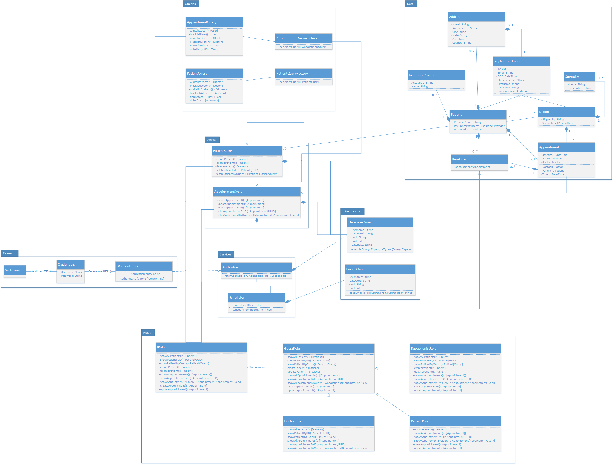
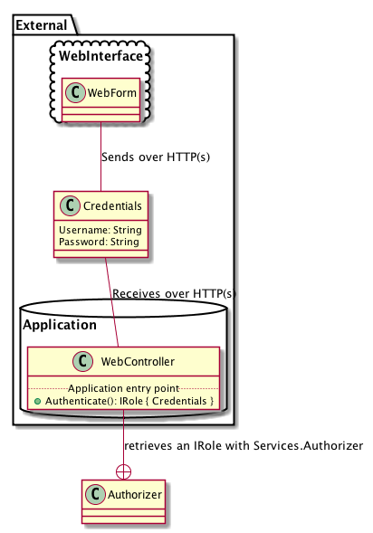
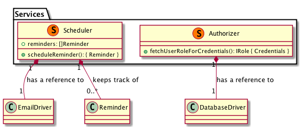
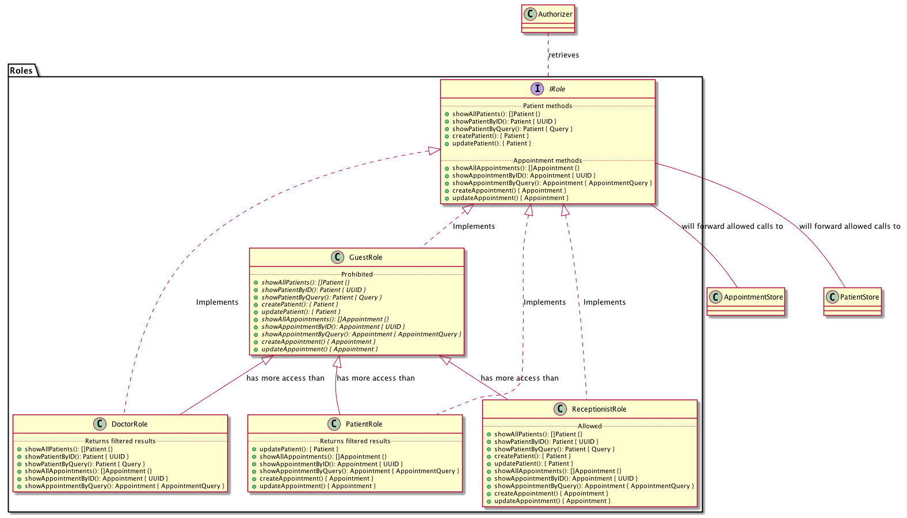
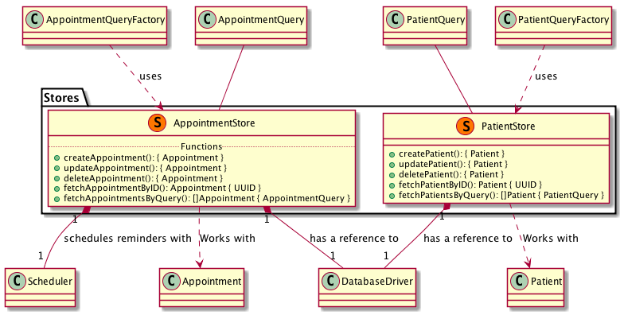
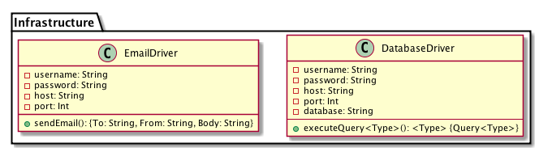
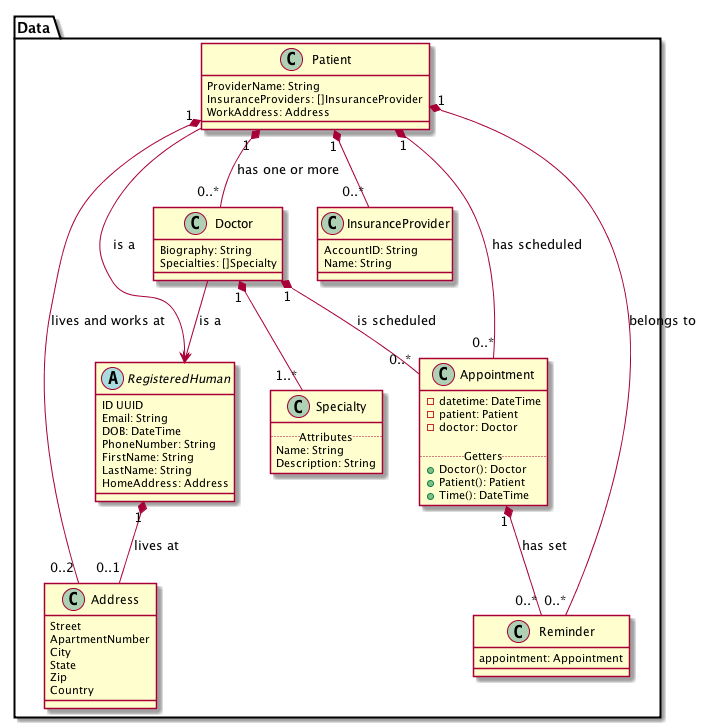
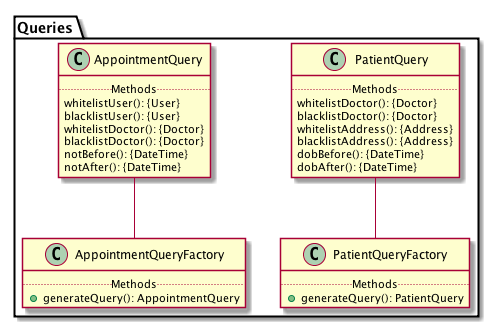

= Clinic class diagrams
:backend: deckjs
:deckjs_theme: swiss
:imagesdir: diagram
:source-highlighter: pygments
:data-uri:
:navigation:

== Overall diagram

== External package

== Services package

== Roles package

== Stores package

== Infrastructure package

== Data package

== Queries package

